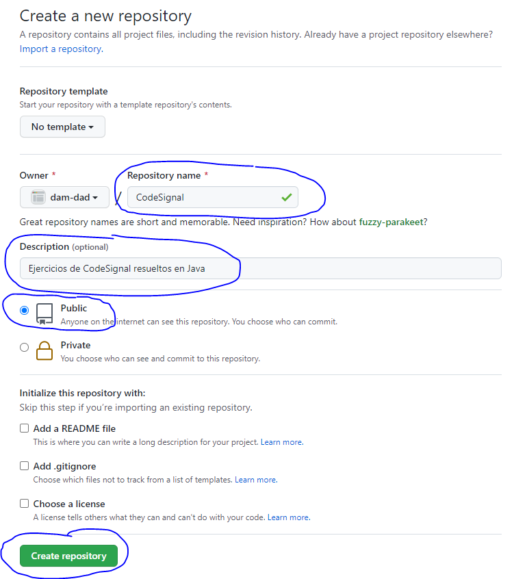

# CodeSignal

Ejercicios resueltos en Java de la plataforma [CodeSignal](https://app.codesignal.com/profile/fvarrui).

## Crear el proyecto con Maven

Abrimos un terminal y ejecutamos el siguiente comando para crear el proyecto:

```bash
mvn archetype:generate -DarchetypeArtifactId=maven-archetype-quickstart
```

Este comando es interactivo, lo que significa que durante su ejecución nos va a pedir información, tal y como se muestra a continuación:

```bash
[INFO] Scanning for projects...
[INFO]
[INFO] ------------------< org.apache.maven:standalone-pom >-------------------
[INFO] Building Maven Stub Project (No POM) 1
[INFO] --------------------------------[ pom ]---------------------------------
[INFO]
[INFO] >>> maven-archetype-plugin:3.2.0:generate (default-cli) > generate-sources @ standalone-pom >>>
[INFO]
[INFO] <<< maven-archetype-plugin:3.2.0:generate (default-cli) < generate-sources @ standalone-pom <<<
[INFO]
[INFO]
[INFO] --- maven-archetype-plugin:3.2.0:generate (default-cli) @ standalone-pom ---
[INFO] Generating project in Interactive mode
Define value for property 'groupId': dad
Define value for property 'artifactId': CodeSignal
Define value for property 'version' 1.0-SNAPSHOT: : 0.0.1
Define value for property 'package' dad: : dad.codesignal
Confirm properties configuration:
groupId: dad                       <----- ID de grupo del nuevo proyecto (usaremos siempre el mismo: "dad" en este caso)
artifactId: CodeSignal             <----- ID del artefacto (nombre del proyecto)
version: 0.0.1                     <----- Número de versión (x.y.z: x = número major, y = número menor, z = revisión/patch)
package: dad.codesignal            <----- Como este arquetipo genera código, nombre del paquete donde se generará
 Y: :
[INFO] ----------------------------------------------------------------------------
[INFO] Using following parameters for creating project from Old (1.x) Archetype: maven-archetype-quickstart:1.0
[INFO] ----------------------------------------------------------------------------
[INFO] Parameter: basedir, Value: C:\Users\fvarrui
[INFO] Parameter: package, Value: dad.codesignal
[INFO] Parameter: groupId, Value: dad
[INFO] Parameter: artifactId, Value: CodeSignal
[INFO] Parameter: packageName, Value: dad.codesignal
[INFO] Parameter: version, Value: 0.0.1
[INFO] project created from Old (1.x) Archetype in dir: C:\Users\fvarrui\CodeSignal
[INFO] ------------------------------------------------------------------------
[INFO] BUILD SUCCESS
[INFO] ------------------------------------------------------------------------
[INFO] Total time:  19.977 s
[INFO] Finished at: 2021-09-17T17:15:13+01:00
[INFO] ------------------------------------------------------------------------
```

La estructura del proyecto creado sería la siguiente:

```bash
CODESIGNAL                              <----- Carpeta del proyecto
│   pom.xml                             <----- Fichero de configuración del proyecto Maven
│
└───src                                 <----- Carpeta para el código fuente (.java) y otros recursos (test)
    ├───main                            <----- Carpeta para los ficheros de código fuente del proyecto
    │   └───java
    │       └───dad
    │           └───codesignal
    │                   App.java        <----- Clase de ejemplo generada por Maven
    │
    └───test                            <----- Carpeta para los test
        └───java
            └───dad
                └───codesignal
                        AppTest.java    <----- Conjunto de test unitarios para la clase "App"
```

## Configurar el proyecto

El fichero de configuración del proyecto Maven es el fichero `pom.xml`, que inicialmente tendrá el siguiente contenido:

```xml
<project xmlns="http://maven.apache.org/POM/4.0.0" xmlns:xsi="http://www.w3.org/2001/XMLSchema-instance"
         xsi:schemaLocation="http://maven.apache.org/POM/4.0.0 http://maven.apache.org/maven-v4_0_0.xsd">
    <modelVersion>4.0.0</modelVersion>
    <groupId>dad</groupId>
    <artifactId>CodeSignal</artifactId>
    <packaging>jar</packaging>
    <version>0.0.1</version>
    <name>CodeSignal</name>
    <url>http://maven.apache.org</url>
    <dependencies>
        <dependency>
            <groupId>junit</groupId>
            <artifactId>junit</artifactId>
            <version>3.8.1</version>
            <scope>test</scope>
        </dependency>
    </dependencies>
</project>
```

A continuación editamos este fichero y añadimos lo siguiente.

### Propiedades

Es recomendable que incluyamos las siguientes propiedades en la configuración de nuestro proyecto:

```xml
<properties>
	<maven.compiler.target>11</maven.compiler.target>
	<maven.compiler.source>11</maven.compiler.source>
	<project.build.sourceEncoding>UTF-8</project.build.sourceEncoding>
    <exec.mainClass>dad.codesignal.App</exec.mainClass>
</properties>
```

Las propiedades `maven.compiler.target` y `maven.compiler.source` indican la versión de Java de los ficheros compilados (`.class`) y del código fuente (`.java`), respectivamente. Normalmente, suelen coincidir.

La propiedad `project.build.sourceEncoding` indica la codificación del código fuente (ficheors `.java`). Es recomentable que utilicemos `UTF-8`.

La propiedad `exec.mainClass` nos permite indicar la clase principal de nuestro proyecto. Es decir, cuando ejecutemos el proyecto con Maven, el método `main` de esta clase será el punto de partida. Debemos indicar la ruta completa de la clase dentro del classpath.

### Versión de jUnit

Nuestro proyecto tiene una dependencia de la librería `junit:junit:3.8.1'`:

```xml
<dependencies>
    <dependency>
        <groupId>junit</groupId>
        <artifactId>junit</artifactId>
        <version>3.8.1</version>
        <scope>test</scope>
    </dependency>
</dependencies>
```

> El ámbito de la dependencia (`scope`) indica que esta librería sólo se utilizará cuando al testear el proyecto (`test`).

Lo que haremos ahora será actualizar jUnit a la versión **4.13.2**.

```xml
<dependency>
    <groupId>junit</groupId>
    <artifactId>junit</artifactId>
    <version>4.13.2</version>
    <scope>test</scope>
</dependency>
```

### Fichero de configuración resultante

Finalmente, nos denbería quedar el fichero de configuración de la siguiente manera:

```xml
<project xmlns="http://maven.apache.org/POM/4.0.0" xmlns:xsi="http://www.w3.org/2001/XMLSchema-instance"
         xsi:schemaLocation="http://maven.apache.org/POM/4.0.0 http://maven.apache.org/maven-v4_0_0.xsd">

    <modelVersion>4.0.0</modelVersion>

    <groupId>dad</groupId>
    <artifactId>CodeSignal</artifactId>
    <version>0.0.1</version>
    <packaging>jar</packaging>

    <name>CodeSignal</name>

    <properties>
        <maven.compiler.target>11</maven.compiler.target>
        <maven.compiler.source>11</maven.compiler.source>
        <project.build.sourceEncoding>UTF-8</project.build.sourceEncoding>
        <exec.mainClass>dad.codesignal.App</exec.mainClass>        
    </properties>

    <dependencies>
        <dependency>
            <groupId>junit</groupId>
            <artifactId>junit</artifactId>
            <version>4.13.2</version>
            <scope>test</scope>
        </dependency>
    </dependencies>
</project>
```

## Compilar el código fuente el proyecto

Ahora ejecutamos el siguiente comando desde el terminal para compilar el proyecto. Estos comandos deben ejecutarse en la misma ubicación donde se encuentra el fichero `pom.xml`:

```bash
mvn compile
```

El resultado debería ser algo como lo siguiente:

```bash
[INFO] Scanning for projects...
[INFO]
[INFO] ---------------------------< dad:CodeSignal >---------------------------
[INFO] Building CodeSignal 0.0.1
[INFO] --------------------------------[ jar ]---------------------------------
[INFO]
[INFO] --- maven-resources-plugin:2.6:resources (default-resources) @ CodeSignal ---
[INFO] Using 'UTF-8' encoding to copy filtered resources.
[INFO] skip non existing resourceDirectory C:\Users\fvarrui\CodeSignal\src\main\resources
[INFO]
[INFO] --- maven-compiler-plugin:3.1:compile (default-compile) @ CodeSignal ---
[INFO] Changes detected - recompiling the module!
[INFO] Compiling 1 source file to C:\Users\fvarrui\CodeSignal\target\classes
[INFO] ------------------------------------------------------------------------
[INFO] BUILD SUCCESS
[INFO] ------------------------------------------------------------------------
[INFO] Total time:  1.346 s
[INFO] Finished at: 2021-09-19T18:06:10+01:00
[INFO] ------------------------------------------------------------------------
```

Si todo ha ido bien, indicará `BUILD SUCCESS`.

Los ficheros compilados se guardarán en `target/classes`.

> El directorio `target` es creado por Maven, y ahí es donde almacena los ficheros generados.

## Testear el proyecto

Si hemos configurado test en nuestro proyecto, estos podremos ejecutarlos con el siguiente comando:

```bash
mvn test
```

La salida sería la siguiente:

```bash
[INFO] Scanning for projects...
[INFO]
[INFO] ---------------------------< dad:CodeSignal >---------------------------
[INFO] Building CodeSignal 0.0.1
[INFO] --------------------------------[ jar ]---------------------------------
[INFO]
[INFO] --- maven-resources-plugin:2.6:resources (default-resources) @ CodeSignal ---
[INFO] Using 'UTF-8' encoding to copy filtered resources.
[INFO] skip non existing resourceDirectory C:\Users\fvarrui\CodeSignal\src\main\resources
[INFO]
[INFO] --- maven-compiler-plugin:3.1:compile (default-compile) @ CodeSignal ---
[INFO] Nothing to compile - all classes are up to date
[INFO]
[INFO] --- maven-resources-plugin:2.6:testResources (default-testResources) @ CodeSignal ---
[INFO] Using 'UTF-8' encoding to copy filtered resources.
[INFO] skip non existing resourceDirectory C:\Users\fvarrui\CodeSignal\src\test\resources
[INFO]
[INFO] --- maven-compiler-plugin:3.1:testCompile (default-testCompile) @ CodeSignal ---
[INFO] Changes detected - recompiling the module!
[INFO] Compiling 1 source file to C:\Users\fvarrui\CodeSignal\target\test-classes
[INFO]
[INFO] --- maven-surefire-plugin:2.12.4:test (default-test) @ CodeSignal ---
[INFO] Surefire report directory: C:\Users\fvarrui\CodeSignal\target\surefire-reports

-------------------------------------------------------
 T E S T S
-------------------------------------------------------
Running dad.codesignal.AppTest
Tests run: 1, Failures: 0, Errors: 0, Skipped: 0, Time elapsed: 0.048 sec

Results :

Tests run: 1, Failures: 0, Errors: 0, Skipped: 0

[INFO] ------------------------------------------------------------------------
[INFO] BUILD SUCCESS
[INFO] ------------------------------------------------------------------------
[INFO] Total time:  1.875 s
[INFO] Finished at: 2021-09-19T18:08:54+01:00
[INFO] ------------------------------------------------------------------------
```

Si todo ha ido bien, indicará que no ha habido fallos (`Failures: 0`).

> Destacar que este comando lleva implícito la compilación del código fuente (`mvn compile`)

## Ejecutar el proyecto

Para poder ejecutar el proyecto es necesario que hayamos indicado en el `pom.xml` la calse principal medinte la propiedad `exec.mainClass`.

El comando para ejecutar el proyecto es el siguiente:

```bash
mvn exec:java
```

La salida del comando incluye la ejecución del proyecto, tal y como se muestra a continucación:

```xml
[INFO] Scanning for projects...
[INFO]
[INFO] ---------------------------< dad:CodeSignal >---------------------------
[INFO] Building CodeSignal 0.0.1
[INFO] --------------------------------[ jar ]---------------------------------
[INFO]
[INFO] --- exec-maven-plugin:3.0.0:java (default-cli) @ CodeSignal ---
Hello World!
[INFO] ------------------------------------------------------------------------
[INFO] BUILD SUCCESS
[INFO] ------------------------------------------------------------------------
[INFO] Total time:  0.795 s
[INFO] Finished at: 2021-09-19T18:11:42+01:00
[INFO] ------------------------------------------------------------------------
```

La clase `dad.codesignal.App` muestra en el terminal la cadena de caracteres `Hello World!`, por lo que todo ha funcionado como esperábamos.

## Publicar el proyecto en GitHub

Para publicar nuestro proyecto en GitHub debemos seguir los siguientes pasos.

### Crear el repositorio remoto en GitHub

GIT utiliza dos repositorios, uno local (en nuestro PC) y otro remoto (alojado en GitHub, en nuestro caso), que podremos sincronizar.

Para crear el repositorio remoto accedemos a nuestro espacio de [GitHub](https://github.com) desde un navegador (https://github.com/username), y desde la pestaña **Repositories** pulsamos el botón **New**:


Introducimos el nombre y descripción del nuevo repositorio (también podemos indicar si queremos que sea público o privado), y pulsamos el botón **Create repository**:



La URL de nuestro repositorio, necesaria para poder vincularlo a nuestro repositorio local, sería https://github.com/username/CodeSignal.git (o simplemente https://github.com/username/CodeSignal, sin ".git").

### Crear el repositorio local

### Perpetrar los cambios (commit)

### Vincular el repositorio local con el remoto de GitHub

### Publicar los cambios en GitHub (push)

